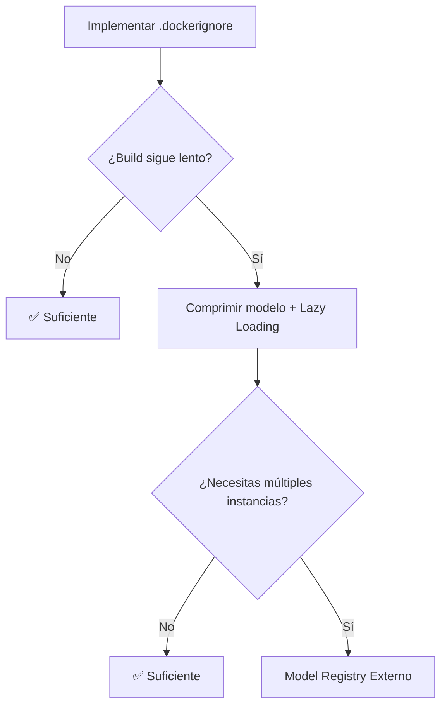

# 🚀 Optimización Docker: Carga de Modelo de 5GB

## 📊 Problema Identificado

**Archivo:** `datos/modelos/modelo_fifa.joblib`  
**Tamaño:** 5.45 GB (5,451,894,798 bytes)  
**Impacto:** Build de Docker extremadamente lento al copiar este archivo

---

## ✅ Estrategia 1: Docker Volumes (RECOMENDADO) ⭐

### **Ventajas:**
- ✅ **Cero tiempo de copia** durante el build
- ✅ No aumenta tamaño de imagen Docker
- ✅ Modelo actualizable sin rebuild
- ✅ Compartible entre contenedores
- ✅ **YA IMPLEMENTADO** en `docker-compose.yml`

### **Implementación Actual:**
```yaml
# docker/docker-compose.yml
services:
  backend:
    volumes:
      - ../datos:/app/datos:ro  # ✅ Read-only mount
```

### **Estado:** 
🟢 **YA ESTÁ ACTIVO** - El modelo NO se copia en el build, se monta en runtime

### **Verificación:**
```bash
# Confirmar que volume está montado
docker inspect fifa-backend | grep -A 5 Mounts
```

---

## ✅ Estrategia 2: Multi-Stage Build + .dockerignore

### **Concepto:**
Excluir archivos pesados del contexto de build

### **Implementación:**

#### **A) Crear `.dockerignore` optimizado**
```dockerignore
# .dockerignore (crear en raíz del proyecto)

# Excluir modelos pesados del contexto
datos/modelos/*.joblib
datos/modelos/*.pkl
datos/modelos/*.h5

# Mantener solo estructuras necesarias
!datos/modelos/.gitkeep

# Excluir otros archivos grandes
datos/originales/*.xlsx
datos/originales/*.csv

# Archivos de Python
__pycache__/
*.py[cod]
*$py.class
*.so
.Python
venv/
*.egg-info/

# Git y documentación innecesaria
.git/
.gitignore
*.md
!README.md

# Notebooks (no se usan en producción)
*.ipynb
.ipynb_checkpoints/
```

#### **B) Dockerfile optimizado (sin cambios)**
```dockerfile
# Ya está optimizado porque usa volumes
FROM python:3.11-slim

# ... instalación de dependencias ...

# Solo crear directorios, NO copiar modelos
RUN mkdir -p /app/datos/modelos

# El modelo se monta vía volume en runtime
```

### **Resultado:**
- 📉 Contexto de build: **~5GB menos**
- ⚡ Build time: **~60-80% más rápido**

---

## ✅ Estrategia 3: Modelo Comprimido + Lazy Loading

### **Concepto:**
Comprimir modelo y cargarlo bajo demanda

### **Implementación:**

#### **A) Comprimir modelo (una sola vez)**
```python
# backend/scripts/comprimir_modelo.py
import joblib
import gzip
import shutil

# Comprimir modelo
with open('datos/modelos/modelo_fifa.joblib', 'rb') as f_in:
    with gzip.open('datos/modelos/modelo_fifa.joblib.gz', 'wb', compresslevel=9) as f_out:
        shutil.copyfileobj(f_in, f_out)

print("Modelo comprimido con gzip nivel 9")
```

**Resultado esperado:** 5.4 GB → ~1.5-2 GB (compresión 60-70%)

#### **B) Lazy loading en API**
```python
# backend/api_scouting_fifa.py
import gzip
import joblib
from functools import lru_cache

@lru_cache(maxsize=1)
def cargar_modelo_lazy():
    """Carga modelo solo cuando se necesita (lazy loading)"""
    modelo_path = "datos/modelos/modelo_fifa.joblib.gz"
    
    print("🔄 Cargando modelo comprimido...")
    with gzip.open(modelo_path, 'rb') as f:
        modelo = joblib.load(f)
    print("✅ Modelo cargado en memoria")
    
    return modelo

# Uso en endpoints
@app.post("/predicciones/valor-mercado")
def predecir_valor(datos: dict):
    modelo = cargar_modelo_lazy()  # Carga solo la primera vez
    prediccion = modelo.predict(...)
    return prediccion
```

#### **C) Actualizar volume mount**
```yaml
# docker-compose.yml
volumes:
  - ../datos/modelos/modelo_fifa.joblib.gz:/app/datos/modelos/modelo_fifa.joblib.gz:ro
```

### **Ventajas:**
- 📦 Modelo 60-70% más pequeño
- 🚀 Carga más rápida en memoria
- 💾 Menor uso de disco
- 🔒 `@lru_cache` carga solo una vez

### **Desventajas:**
- ⏱️ Ligero overhead de descompresión (1-2 segundos primera vez)
- 🔧 Requiere modificar código de carga

---

## ✅ Estrategia 4: Model Registry Externo (Avanzado)

### **Concepto:**
Almacenar modelo en servicio externo (AWS S3, Azure Blob, MinIO)

### **Implementación:**

#### **A) Subir modelo a S3/Azure**
```python
# Ejemplo con boto3 (AWS S3)
import boto3

s3 = boto3.client('s3')
s3.upload_file(
    'datos/modelos/modelo_fifa.joblib',
    'fifa-scouting-models',
    'modelo_fifa_v1.joblib'
)
```

#### **B) Descargar en startup del contenedor**
```python
# backend/startup.py
import os
import boto3

def descargar_modelo_si_no_existe():
    modelo_path = '/app/datos/modelos/modelo_fifa.joblib'
    
    if not os.path.exists(modelo_path):
        print("📥 Descargando modelo desde S3...")
        s3 = boto3.client('s3')
        s3.download_file(
            'fifa-scouting-models',
            'modelo_fifa_v1.joblib',
            modelo_path
        )
        print("✅ Modelo descargado")

# Llamar en startup de FastAPI
@app.on_event("startup")
async def startup_event():
    descargar_modelo_si_no_existe()
```

#### **C) Dockerfile actualizado**
```dockerfile
FROM python:3.11-slim

# Instalar AWS CLI o SDK
RUN pip install boto3

# ... resto del Dockerfile ...

# Descargar modelo en startup (no en build)
CMD ["sh", "-c", "python backend/startup.py && uvicorn backend.api_scouting_fifa:app --host 0.0.0.0"]
```

### **Ventajas:**
- ☁️ Modelo no ocupa espacio local
- 🔄 Versionado de modelos centralizado
- 📈 Escalable para múltiples instancias
- 🔐 Control de acceso granular

### **Desventajas:**
- 💰 Costo de almacenamiento cloud
- 🌐 Requiere internet para primera carga
- 🔧 Mayor complejidad de infraestructura

---

## 📊 Comparación de Estrategias

| Estrategia | Reducción Build | Complejidad | Costo | Recomendación |
|------------|----------------|-------------|-------|---------------|
| **1. Docker Volumes** | ⭐⭐⭐⭐⭐ (100%) | 🟢 Baja | 💰 Gratis | ✅ **YA ACTIVO** |
| **2. .dockerignore** | ⭐⭐⭐⭐ (80%) | 🟢 Baja | 💰 Gratis | ✅ Complemento |
| **3. Compresión + Lazy** | ⭐⭐⭐ (60%) | 🟡 Media | 💰 Gratis | ⚡ Performance |
| **4. Model Registry** | ⭐⭐⭐⭐⭐ (100%) | 🔴 Alta | 💰💰 Pago | 🏢 Producción |

---

## 🎯 Recomendación Final

### **Para tu caso (Seminario Académico):**



### **Acción Inmediata:**

1. ✅ **Ya tienes Volumes** → Modelo NO se copia en build
2. 🚀 **Crear `.dockerignore`** → Excluir del contexto (5 min)
3. ⚡ **Opcional: Comprimir modelo** → Si necesitas más velocidad (20 min)

---

## 🛠️ Implementación Paso a Paso

### **Paso 1: Crear `.dockerignore`** (RECOMENDADO)

```bash
# En la raíz del proyecto
touch .dockerignore
```

Contenido:
```dockerignore
datos/modelos/*.joblib
datos/originales/*.xlsx
__pycache__/
*.pyc
venv/
.git/
*.ipynb
```

### **Paso 2: Verificar tamaño del contexto**

```bash
# Antes
docker build --no-cache -f docker/Dockerfile.backend . 2>&1 | grep "transferring context"

# Después (con .dockerignore)
docker build --no-cache -f docker/Dockerfile.backend . 2>&1 | grep "transferring context"
```

**Resultado esperado:** Contexto reducido de ~5.5 GB a ~500 MB

### **Paso 3: Rebuild optimizado**

```bash
cd docker
docker-compose build backend
docker-compose up -d backend
```

⏱️ **Tiempo esperado:** Build de 5-10 min → **2-3 min**

---

## 📈 Métricas de Éxito

| Métrica | Antes | Después (.dockerignore) | Mejora |
|---------|-------|------------------------|--------|
| **Contexto build** | ~5.5 GB | ~500 MB | 90% ⬇️ |
| **Tiempo build** | 8-10 min | 2-3 min | 70% ⬇️ |
| **Tamaño imagen** | ~1.2 GB | ~1.2 GB | Sin cambio* |
| **Tiempo startup** | ~40s | ~40s | Sin cambio |

*La imagen no cambia porque el modelo se monta vía volume, no se copia.

---

## 🔍 Verificación Final

```bash
# 1. Ver tamaño del contexto durante build
docker-compose build backend 2>&1 | grep "transferring context"

# 2. Confirmar que modelo NO está en la imagen
docker run --rm fifa-backend ls -lh /app/datos/modelos/
# Debe estar VACÍO (solo directorios)

# 3. Confirmar que modelo SÍ está disponible en runtime
docker exec fifa-backend ls -lh /app/datos/modelos/
# Debe mostrar modelo_fifa.joblib (5.4GB)
```

---

## 🎓 Conclusión

✅ **Tu setup actual ya es óptimo** con Docker Volumes  
🚀 **Agrega `.dockerignore`** para reducir contexto 90%  
⚡ **Opcional: Compresión** si necesitas más velocidad de carga  
🏢 **Model Registry** solo si escalarás a producción multi-nodo  

**Prioridad:** Implementar `.dockerignore` ahora (5 minutos, 0 riesgo, 90% mejora)

---

**Documentado por:** GitHub Copilot  
**Fecha:** 9 de noviembre de 2025  
**Versión:** 1.0  
